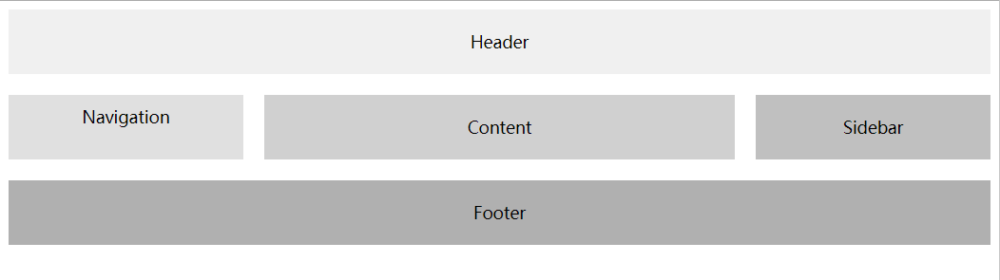
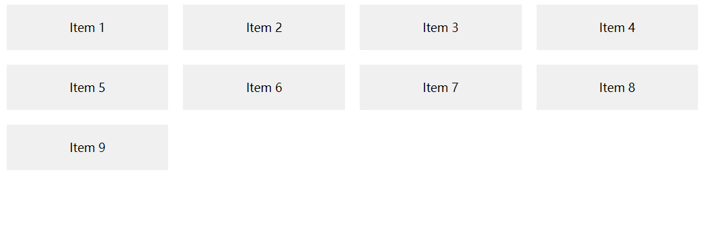

# Grid 布局：现代网页布局的终极解决方案

## 1. 理解 Grid 布局

Grid 布局是一种二维布局模型，可以将网页划分为网格，其中包含了行（rows）和列（columns）。通过将网格容器（Grid Container）分割为网格单元格（Grid Cells），开发者可以更轻松地控制页面元素在网格中的位置和大小。Grid 布局在 CSS 规范中被称为 "CSS Grid Layout" 或 "Grid"。

### 1.1 网格容器与网格项

要使用 Grid 布局，首先需要将一个 HTML 元素定义为网格容器。我们可以通过设置 `display: grid;` 来实现：

```css
.grid-container {
  display: grid;
}
```

容器内部的子元素即成为网格项（Grid Items）。网格项可以跨越多个网格单元格，也可以占据一个单元格。我们可以通过指定网格项的位置来控制它们在网格中的布局。

### 1.2 行与列

Grid 布局的核心是行和列，通过定义网格的行和列，我们可以创造出复杂的网页布局。在网格容器中，通过 `grid-template-columns` 和 `grid-template-rows` 属性来定义列和行的大小和结构：

```css
.grid-container {
  display: grid;
  grid-template-columns: 1fr 2fr 1fr; /* 定义三列，第二列是第一列的两倍宽度 */
  grid-template-rows: 100px auto; /* 定义两行，第一行高度为 100px，第二行高度自适应 */
}
```

### 1.3 网格线与网格跨度

在 Grid 布局中，网格线（Grid Lines）是定义网格单元格边界的线条。水平的网格线定义了行，而垂直的网格线定义了列。我们可以通过指定网格线的名称或索引来定位网格项。

网格跨度（Grid Span）允许一个网格项跨越多个行或列。我们可以使用 `grid-column` 和 `grid-row` 属性来指定一个网格项的位置和跨度：

```css
.grid-item {
  grid-column: 2 / 4; /* 网格项跨越第二列到第四列 */
  grid-row: 1 / 3; /* 网格项跨越第一行到第三行 */
}
```

## 2. Grid 布局的属性详解

Grid 布局提供了一系列强大的属性，用于更精确地控制网页布局。以下是一些常用的 Grid 属性：

### 2.1 `grid-template-columns` 和 `grid-template-rows`

`grid-template-columns` 和 `grid-template-rows` 用于定义网格的列和行的大小和结构。可以指定固定大小（如像素、百分比等），也可以使用 `fr` 单位表示可用空间的比例分配。可以使用空格分隔值来创建多列或多行。

```css
.grid-container {
  display: grid;
  grid-template-columns: 1fr 2fr 1fr; /* 三列，第二列是第一列的两倍宽度 */
  grid-template-rows: 100px auto; /* 两行，第一行高度为 100px，第二行高度自适应 */
}
```

### 2.2 `grid-template-areas`

`grid-template-areas` 允许通过指定网格区域的名称来创建更具语义的布局。通过在网格容器中使用网格区域名称，而不是使用行和列属性，可以更清晰地定义布局结构。

```css
.grid-container {
  display: grid;
  grid-template-areas:
    'header header header'
    'sidebar content content'
    'footer footer footer';
}

.header {
  grid-area: header;
}

.sidebar {
  grid-area: sidebar;
}

.content {
  grid-area: content;
}

.footer {
  grid-area: footer;
}
```

### 2.3 `grid-template`

`grid-template` 是 `grid-template-columns`、`grid-template-rows` 和 `grid-template-areas` 的缩写属性。可以通过一个属性同时定义列、行和区域。

```css
.grid-container {
  display: grid;
  grid-template:
    'header header header' 100px
    'sidebar content content' auto
    'footer footer footer' 50px;
}
```

### 2.4 `grid-gap`

`grid-gap` 定义网格项之间的间隔（行和列之间的间距）。可以使用两个值表示行和列的间隔。

```css
.grid-container {
  display: grid;
  grid-gap: 10px 20px; /* 行间距为 10px，列间距为 20px */
}
```

### 2.5 `grid-column-gap` 和 `grid-row-gap`

`grid-column-gap` 和 `grid-row-gap` 分别定义网格列和行之间的间隔。与 `grid-gap` 类似，但允许分别指定列和行的间隔。

```css
.grid-container {
  display: grid;
  grid-column-gap: 20px; /* 列间距为 20px */
  grid-row-gap: 10px; /* 行间距为 10px */
}
```

### 2.6 `grid-auto-columns` 和 `grid-auto-rows`

`grid-auto-columns` 和 `grid-auto-rows` 定义了当网格容器中的网格项目无法放入先前定义的网格轨道时，自动创建的额外列和行的大小。可以指定固定大小或使用 `fr` 单位。

```css
.grid-container {
  display: grid;
  grid-template-columns: 100px 200px; /* 定义两列 */
  grid-auto-columns: 50px; /* 自动创建的额外列宽度为 50px */
}
```

### 2.7 `grid-auto-flow`

`grid-auto-flow` 定义了当网格项目无法放入先前定义的网格轨道时，如何自动创建额外的网格项目。默认值是 `row`，表示按照行进行放置，也可以设置为 `column`。

```css
.grid-container {
  display: grid;
  grid-auto-flow: column; /* 自动创建的额外项目按照列进行放置 */
}
```

### 2.8 `justify-items` 和 `align-items`

`justify-items` 和 `align-items` 用于在网格项目中定义对齐方式。`justify-items` 控制项目在列轴上的对齐方式，`align-items` 控制项目在行轴上的对齐方式。

```css
.grid-container {
  display: grid;
  justify-items: center; /* 项目在列轴上居中对齐 */
  align-items: end; /* 项目在行轴上底部对齐 */
}
```

### 2.9 `justify-content` 和 `align-content`

`justify-content` 和 `align-content` 用于定义网格项目在网格容器内部的对齐方式。`justify-content` 控制网格项目在列轴上的对齐方式，`align-content` 控制网格项目在行轴上的对齐方式。

```css
.grid-container {
  display: grid;
  justify-content: center; /* 项目在列轴上居中对齐 */
  align-content: space-between; /* 项目在行轴上均匀分布 */
}
```

### 2.10 `justify-self` 和 `align-self`

`justify-self` 和 `align-self` 用于定义单个网格项目自身在网格单元格中的对齐方式。`justify-self` 控制项目在列轴上的对齐方式，`align-self` 控制项目在行轴上的对齐方式。

```css
.grid-item {
  justify-self: end; /* 项目在列轴上右对齐 */
  align-self: center; /* 项目在行轴上居中对齐 */
}
```

### 2.11 `grid-column` 和 `grid-row`

`grid-column` 和 `grid-row` 用于将网格项目放置在指定的列和行位置。可以使用数字、`span` 关键字、网格线名称或 `auto` 值来指定位置。

```css
.grid-item {
  grid-column: 2 / 4; /* 网格项跨越第二列到第四列 */
  grid-row: 1 / 3; /* 网格项跨越第一行到第三行 */
}
```

## 3. 创建网格布局

使用 Grid 布局，我们可以创建灵活且复杂的网页布局。了解如何创建网格布局对于掌握 Grid 布局至关重要。

### 3.1 网格轨道的大小和增长

网格轨道（Grid Track）是相邻网格线之间的空间，包括行轨道和列轨道。我们可以通过设置网格轨道的大小和增长方式来控制网格布局。

```css
.grid-container {
  display: grid;
  grid-template-columns: 100px auto 1fr; /* 定义三列，第一列宽度为 100px，第二

列宽度自适应，第三列占据剩余空间 */
  grid-template-rows: 50px 1fr; /* 定义两行，第一行高度为 50px，第二行占据剩余空间 */
}
```

在上述示例中，我们使用 `auto` 关键字和 `1fr` 单位来设置网格轨道的大小。`auto` 关键字表示网格轨道的大小将根据其内容自动调整，而 `1fr` 表示网格轨道的大小将占据剩余可用空间。

### 3.2 网格模板的定义

通过使用网格模板（Grid Template），我们可以更加直观地定义网格布局，使得布局结构更加清晰。

```css
.grid-container {
  display: grid;
  grid-template-columns: repeat(3, 1fr); /* 定义三列，每列宽度为1fr */
  grid-template-rows: repeat(2, 100px); /* 定义两行，每行高度为100px */
}
```

在上述示例中，我们使用 `repeat()` 函数来定义网格模板，它可以简化重复的设置。通过 `repeat(3, 1fr)`，我们定义了三列，每列宽度为 `1fr`。

### 3.3 响应式设计与媒体查询

Grid 布局与响应式设计完美结合，通过使用媒体查询（Media Queries），我们可以在不同的屏幕尺寸和设备上应用不同的网格布局。

```css
.grid-container {
  display: grid;
  grid-template-columns: 1fr; /* 默认一个列，适用于手机屏幕 */
}

@media (min-width: 768px) {
  .grid-container {
    grid-template-columns: repeat(2, 1fr); /* 大于768px时，使用两列布局 */
  }
}

@media (min-width: 1200px) {
  .grid-container {
    grid-template-columns: repeat(3, 1fr); /* 大于1200px时，使用三列布局 */
  }
}
```

在上述示例中，我们使用媒体查询来根据不同屏幕尺寸应用不同的网格布局。当屏幕宽度大于 768px 时，使用两列布局，当屏幕宽度大于 1200px 时，使用三列布局。

## 4. Grid 布局的实际应用

Grid 布局在实际应用中非常强大，可以用于创建各种复杂的网页布局。

### 4.1 简单网页布局

Grid 布局可以用于创建简单的网页布局，如标题、导航栏和内容区域。

```html
<!DOCTYPE html>
<html lang="en">
  <head>
    <meta charset="UTF-8" />
    <meta name="viewport" content="width=device-width, initial-scale=1.0" />
    <title>Simple Grid Layout</title>
    <style>
      .grid-container {
        display: grid;
        grid-template-columns: 1fr;
        grid-gap: 20px;
      }
      .header {
        background-color: #f0f0f0;
        padding: 20px;
        text-align: center;
      }
      .nav {
        background-color: #e0e0e0;
        padding: 10px;
        text-align: center;
      }
      .content {
        background-color: #d0d0d0;
        padding: 20px;
        text-align: center;
      }
    </style>
  </head>
  <body>
    <div class="grid-container">
      <div class="header">Header</div>
      <div class="nav">Navigation</div>
      <div class="content">Content</div>
    </div>
  </body>
</html>
```

在上述示例中，我们创建了一个简单的网页布局，其中使用了 Grid 布局将标题、导航栏和内容区域分为三个网格项，通过设置网格容器的列模板为 `1fr`，使得三个网格项平均占据网格容器的宽度。

### 4.2 复杂网页布局

Grid 布局可以应用于创建复杂的网页布局，如新闻网站的首页布局。

```html
<!DOCTYPE html>
<html lang="en">
  <head>
    <meta charset="UTF-8" />
    <meta name="viewport" content="width=device-width, initial-scale=1.0" />
    <title>Complex Grid Layout</title>
    <style>
      .grid-container {
        display: grid;
        grid-template-columns: 1fr 2fr 1fr; /* 三列 */
        grid-template-rows: auto 1fr; /* 两行 */
        grid-gap: 20px;
      }
      .header {
        background-color: #f0f0f0;
        grid-column: 1 / 4; /* 横跨三列 */
        padding: 20px;
        text-align: center;
      }
      .nav {
        background-color: #e0e0e0;

        grid-column: 1 / 2; /* 横跨第一列 */
        grid-row: 2 / 3; /* 跨越第二行 */
        padding: 10px;
        text-align: center;
      }
      .content {
        background-color: #d0d0d0;
        grid-column: 2 / 3; /* 占据第二列 */
        grid-row: 2 / 3; /* 跨越第二行 */
        padding: 20px;
        text-align: center;
      }
      .sidebar {
        background-color: #c0c0c0;
        grid-column: 3 / 4; /* 占据第三列 */
        grid-row: 2 / 3; /* 跨越第二行 */
        padding: 20px;
        text-align: center;
      }
      .footer {
        background-color: #b0b0b0;
        grid-column: 1 / 4; /* 横跨三列 */
        grid-row: 3 / 4; /* 占据第三行 */
        padding: 20px;
        text-align: center;
      }
    </style>
  </head>
  <body>
    <div class="grid-container">
      <div class="header">Header</div>
      <div class="nav">Navigation</div>
      <div class="content">Content</div>
      <div class="sidebar">Sidebar</div>
      <div class="footer">Footer</div>
    </div>
  </body>
</html>
```

在上述示例中，我们创建了一个复杂的网页布局，其中使用了 Grid 布局将网页划分为多个网格项。通过设置网格项的网格位置和跨度，我们可以实现复杂的布局结构，如标题横跨三列，导航栏、内容区域和侧边栏位于第二行，页脚位于第三行。



### 4.3 布局的嵌套与组合

Grid 布局可以嵌套使用，从而创建更加复杂和多样化的布局。

```html
<!DOCTYPE html>
<html lang="en">
  <head>
    <meta charset="UTF-8" />
    <meta name="viewport" content="width=device-width, initial-scale=1.0" />
    <title>Nested Grid Layout</title>
    <style>
      .grid-container {
        display: grid;
        grid-template-columns: repeat(2, 1fr); /* 两列 */
        grid-template-rows: auto; /* 自适应高度 */
        grid-gap: 20px;
      }
      .header {
        background-color: #f0f0f0;
        grid-column: 1 / 3; /* 横跨两列 */
        padding: 20px;
        text-align: center;
      }
      .content-container {
        display: grid;
        grid-template-columns: 1fr 2fr; /* 两列 */
        grid-template-rows: auto 1fr; /* 两行 */
        grid-gap: 10px;
      }
      .nav {
        background-color: #e0e0e0;
        grid-column: 1 / 2; /* 横跨第一列 */
        grid-row: 2 / 3; /* 跨越第二行 */
        padding: 10px;
        text-align: center;
      }
      .content {
        background-color: #d0d0d0;
        grid-column: 2 / 3; /* 占据第二列 */
        grid-row: 1 / 3; /* 跨越两行 */
        padding: 20px;
        text-align: center;
      }
      .sidebar {
        background-color: #c0c0c0;
        grid-column: 1 / 2; /* 横跨第一列 */
        grid-row: 1 / 2; /* 占据第一行 */
        padding: 20px;
        text-align: center;
      }
      .footer {
        background-color: #b0b0b0;
        grid-column: 1 / 3; /* 横跨两列 */
        grid-row: 3 / 4; /* 占据第三行 */
        padding: 20px;
        text-align: center;
      }
    </style>
  </head>
  <body>
    <div class="grid-container">
      <div class="header">Header</div>
      <div class="content-container">
        <div class="nav">Navigation</div>
        <div class="content">Content</div>
      </div>
      <div class="sidebar">Sidebar</div>
      <div class="footer">Footer</div>
    </div>
  </body>
</html>
```

在上述示例中，我们创建了一个嵌套的网格布局。其中，我们首先创建了一个主要的网格容器，将页面划分为两列，标题横跨两列。然后，我们在网格项中嵌套另一个网格容器，用于进一步划分内容区域。这样，我们可以在同一个网格项中实现更复杂的布局。

### 4.4 网格的动态调整

Grid 布局的一个重要特点是网格项目的动态调整。网格项可以根据内容的大小自动调整，也可以通过调整网格容器的大小来实现动态布局。

```html
<!DOCTYPE html>
<html lang="en">
  <head>
    <meta charset="UTF-8" />
    <meta name="viewport" content="width=device-width, initial-scale=1.0" />
    <title>Dynamic Grid Layout</title>
    <style>
      .grid-container {
        display: grid;
        grid-template-columns: repeat(auto-fill, minmax(200px, 1fr)); /* 动态调整列数 */
        grid-gap: 20px;
      }
      .grid-item {
        background-color: #f0f0f0;
        padding: 20px;
        text-align: center;
      }
    </style>
  </head>
  <body>
    <div class="grid-container">
      <div class="grid-item">Item 1</div>
      <div class="grid-item">Item 2</div>
      <div class="grid-item">Item 3</div>
      <div class="grid-item">Item 4</div>
      <div class="grid-item">Item 5</div>
      <div class="grid-item">Item 6</div>
      <div class="grid-item">Item 7</div>
      <div class="grid-item">Item 8</div>
      <div class="grid-item">Item 9</div>
    </div>
  </body>
</html>
```

在上述示例中，我们使用 `repeat(auto-fill, minmax(200px, 1fr))` 来定义网格容器的列模板。这将使网格容器动态调整列数，以填充可用空间，并保持每列最小宽度为 200px，最大宽度为可用空间的一份之一。


## 5. Grid 布局与 Flexbox 的比较

Grid 布局和 Flexbox 布局是 CSS 中两种常用的布局模型。它们分别适用于不同的布局需求，并可以结合使用以实现复杂的布局。

### 5.1 适用场景

- Grid 布局：适用于创建二维布局，即同时控制行和列的布局。Grid 布局适用于复杂的网页布局，如主页布局、产品展示页面等。
- Flexbox 布局：适用于单一方向的布局，即只控制主轴或交叉轴的布局。Flexbox 布局适用于简单的水平或垂直布局，如导航菜单、列表等。

### 5.2 布局的差异与共同点

- Grid 布局：可以实现更复杂的布局结构，支持二维布局，可以精确控制网格项的位置和跨度，支持网格区域的命名，更具语义性。
- Flexbox 布局：适用于一维布局，支持在主轴上对齐网格项，支持网格项在主轴上的换行、对齐和排序，适用于弹性布局需求。

- 共同点：都支持灵活的响应式设计，可以根据屏幕尺寸和设备动态调整布局，都可以结合媒体查询实现不同屏幕尺寸下的适配，都支持对齐和排序网格项。

## 6. 常见问题与最佳实践

在使用 Grid 布局时，我们可能会遇到一些常见问题，以下是一些最佳实践和优化建议：

### 6.1 网格项目的排序与定位

在 Grid 布局中，网格项的顺序并不一定与它们在 HTML 中的顺序一致。可以使用 `order` 属性来改变网格项的顺序。

```css
.grid-item:nth-child(3) {
  order: 1; /* 将第三个网格项置于第一个位置 */
}
```

### 6.2 跨浏览器兼容性

虽然 Grid 布局在现代浏览器中得到了很好的支持，但在旧版本的浏览器中可能存在兼容性问题。为了确保网页在不同浏览器中正常显示，可以使用 CSS 前缀或回退方案。

### 6.3 性能考虑

尽管 Grid 布局强大，但在某些情况下可能会对性能产生一定影响。当网页中包含大量网格项和复杂的布局时，可能会导致渲染性能下降。在使用 Grid 布局时，建议合理控制网格项的数量和布局复杂度，以优化网页性能。

### 6.4 最佳实践与优化建议

- 使用网格模板（grid-template）和网格区域（grid-template-areas）来定义布局，以提高代码的可读性和维护性。
- 嵌套使用 Grid 布局，实现更复杂的布局需求。
- 结合 Flexbox 布局，实现一维和二维布局的组合效果。
- 使用媒体查询和响应式设计，实现在不同设备和屏幕尺寸下的布局适配。
- 使用 CSS 前缀和回退方案，确保在不支持 Grid 布局的旧版浏览器中正常显示。
