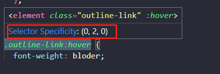

# 选择器优先级

一般情况下，选择器的优先级为

> !important 行内 \> ID 选择器 \> 类选择器 \> 元素选择器 \> 通配选择器
>
> 相同级别的选择器，显示最后面的样式。

## CSS 权重

::: tip 详细描述
1. 计算方式：每个选择器，都可以算出一组权重，格式为（a,b,c)
> 格式: (a, b, c)
>> a: **ID** 选择器的个数
>>
>> b: **类、伪类、属性** 选择器的个数
>>
>> c: **元素、伪元素** 选择器的个数

2. 比较规则：按照**从左到右**的顺序，依次比较大小，当前位胜出后，后面的不再对比，例如：
> (1,0,0) > (0,2,2)
>
> (1,1,0) > (1,0,3)
>
> (1,1,3) > (1,1,2)

3. 特殊规则：
    - **行内样式**权重大于**所有选择器**
    - **!important**的权重，大于**行内样式**，大于**所有选择器，权重最高！**

:::

- 在vscode中，鼠标悬浮在样式上，会弹出来显示选择器、权重。
