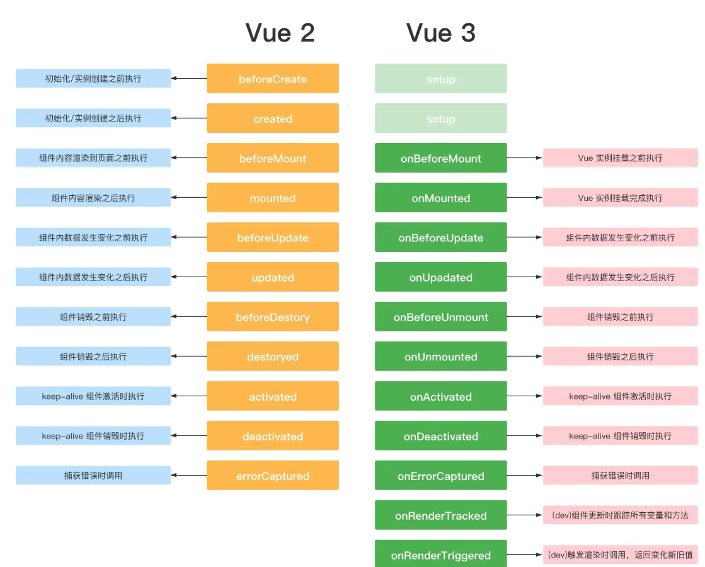

# vue3 API

> [vue在线学习工具](https://sfc.vuejs.org/)

> 在 vue3.2 中，我们只需在`script`标签中添加`setup`。就可以做到，组件只需引入不用注册，属性和方法也不用 return 才能于 template 中使用，也不用写`setup`函数，也不用写**export default** ，甚至是自定义指令也可以在我们的`template`中自动获得。
>
> 本篇内容基于`setup`语法糖下进行。

## setup

1. 理解：Vue3.0 中一个新的配置项，值为一个函数。
2. setup() 函数是 Vue3 新增的一个选项，它是组合式 API 的统一入口，简单来说，就是所有的 **CompositionAPI** 新特性都应该写在这个函数内部。
3. 组件中所用到的：数据、方法等等，均要配置在 setup 中。

```vue
<template>
  <div>{{ message }}</div>
</template>

<script setup lang="ts">
  const message = 'abcde'
</script>
```

## ref 和 reactive

- `ref()` 函数用来根据给定的值创建一个响应式的数据对象，`ref()` 函数调用的返回值是一个对象，这个对象上只包含一个 `value` 属性, 只在setup函数内部访问`ref`函数需要加`.value`，其用途创建独立的原始值
- `reactive()` 函数接收一个普通对象，返回一个响应式的数据对象,使用reactive 去修改值无须`.value`。

> ref其实也是内部调用 reactive 来实现的

```vue
<template>
  <div>
    <div>count1: {{count1}}</div>
    <div>count2: {{count2.val}}</div>
    <div>count3: {{count3.val}}</div>
    <button @click="add">按钮</button>
  </div>
</template>

<script setup>
import { ref, reactive } from 'vue';
    const count1 = ref(0);
    const count2 = ref({ val: 10 });

    // reactive只能接收引用类型, Object、Array...
    const count3 = reactive({ val: 100 });

    function add() {
      count1.value++;
      count2.value.val++;
      count3.val++;
    }
</script>

```
::: tip 提示
- template 模板中使用的数据和方法，都需要通过 setup 函数 return 出去才可以被使用。
- ref 函数创建的响应式数据，在模板中可以直接被使用，在 JS 中需要通过 .value 的形式才能使用。
- ref 函数可以接收原始数据类型与引用数据类型。
- reactive 函数只能接收引用数据类型。
:::

## ref全家桶
### isRef
判断是不是一个ref对象
```js
import { ref,isRef } from 'vue'
let message = ref("我是message")
let notRef:number = 123
const changeMsg = () => {
  message.value = "change msg"
  console.log(isRef(message)); //true
  console.log(isRef(notRef)); //false
}
```

### shallowRef
创建一个跟踪自身 .value 变化的 ref，但不会使其值也变成响应式的

修改其属性是非响应式的这样是不会改变的
```vue
<template>
  <div>
    <button @click="changeMsg">change</button>
    <div>{{ message }}</div>
  </div>
</template>

<script setup lang="ts">
import { Ref, shallowRef } from 'vue'
type Obj = {
  name: string
}
let message: Ref<Obj> = shallowRef({
  name: "zhangsan"
})

const changeMsg = () => {
  message.value.name = 'lisi' // 改变不了
}
</script>
```
这样是可以被监听到的修改value
```js
const changeMsg = () =>{
    message.value = {name:'lisi'}
}
```

### triggerRef
强制更新页面DOM
```js
import {Ref,shallowRef,triggerRef} from 'vue'
type Obj = {
    name:string
}
let message:Ref<Obj> = shallowRef({
    name:'zs'
})
const changeMsg = () =>{
    message.value = {name:'lisi'}
    triggerRef(message)
}
```

### customRef
自定义ref

customRef 是个工厂函数要求我们返回一个对象 并且实现 get 和 set  适合去做防抖之类的
```vue
<template>
  <div ref="div">Ref</div>
  <hr>
  <div>
    {{ name }}
  </div>
  <hr>
  <button @click="change">修改 customRef</button>
</template>

<script setup lang='ts'>
import { ref, reactive, onMounted, shallowRef, customRef } from 'vue'

function myRef<T = any>(value: T) {
  let timer:any;
  return customRef((track, trigger) => {
    return {
      get() {
        track()
        return value
      },
      set(newVal) {
        clearTimeout(timer)
        timer =  setTimeout(() => {
          console.log('触发了set')
          value = newVal
          trigger()
        },500)
      }
    }
  })
}
const name = myRef<string>('zs')

const change = () => {
  name.value = 'lisi'
}
</script>
```
```vue
// 创建一个自定义的 ref，并对其依赖项跟踪和更新触发进行显式控制
// 需求: 使用 customRef 实现 debounce 的示例
<template>
  <h2>App</h2>
  <input v-model="keyword" placeholder="搜索关键字" />
  <p>{{ keyword }}</p>
</template>

<script setup lang="ts">
import { ref, customRef } from "vue";

const keyword = useDebouncedRef("", 500);
console.log(keyword);

/*
实现函数防抖的自定义ref
*/
function useDebouncedRef<T>(value: T, delay = 200) {
  let timeout: number;
  return customRef((track, trigger) => {
    return {
      get() {
        // 告诉Vue追踪数据
        track();
        return value;
      },
      set(newValue: T) {
        clearTimeout(timeout);
        timeout = setTimeout(() => {
          value = newValue;
          // 告诉Vue去触发界面更新
          trigger();
        }, delay);
      },
    };
  });
}
</script>

```

## reactive全家桶
reactive是不可以绑定普通的**数据类型**这样是不允许 会给我们报错
```js
import { reactive} from 'vue'
let person = reactive('zhangsan')
// 控制台警告 value cannot be made reactive: zhangsan
```

### readonly
readonly 接受一个对象 (不论是响应式还是普通的) 或是一个 ref，返回一个原值的只读代理。
```vue
<script setuo>
import { readonly } from 'vue'
  const student = readonly({
      name: '橙某人'
  });
  student.name = 'YDYDYDQ'; // 不可修改
</script>
```

### shallowReactive
只能对浅层的数据 如果是深层的数据只会改变值 不会改变视图
```vue
<template>
  <div>
    <div>{{ state }}</div>
    <button @click="change1">test1</button>
    <button @click="change2">test2</button>
  </div>
</template>

<script setup lang="ts">
import { shallowReactive } from 'vue'
const state = shallowReactive({
  a: 1,
  first: {
    b: 2,
    second: {
      c: 3
    }
  }
})
function change1() {
  state.a ++
}
function change2() {
  state.first.b ++
  state.first.second.c = 9
  console.log(state);
}
</script>
```


## to系列全家桶
### toRef
把一个响应式对象转换成普通对象，该普通对象的每个 property 都是一个 ref

如果原始对象是**非响应式**的，数据是会变的，但不会更新视图。
```vue
<template>
  <div>
     <button @click="change">按钮</button>
     {{state}}
  </div>
</template>

<script setup lang="ts">
import { reactive, toRef } from 'vue'

const obj = {
  name: '张三',
  age: 20
}

const state = toRef(obj, 'age')

const change = () => {
  state.value++
  console.log('obj:',obj,'state:', state);
}
</script>
```

### toRefs
toRefs相当于对对象内每个属性调用toRef，toRefs返回的对象内的属性使用时需要加.value,主要是方便我们解构使用
```vue
<template>
  <div>
    <button @click="change">按钮</button>
    name--{{name}}---age{{age}}
  </div>
</template>

<script setup lang="ts">
import { reactive, toRefs } from 'vue'

const obj = reactive({
  name: '张三',
  age: 18
})

let { name, age } = toRefs(obj)

const change = () => {
  age.value++
  name.value = '李四'
  console.log('obj:', obj);
  console.log('name:', name);
  console.log('age:', age);
}
</script>
```

### toRaw
将响应式对象修改为普通对象
```vue
<template>
  <div>
    <button @click="change">按钮</button>
    {{data}}
  </div>
</template>

<script setup lang="ts">
import { reactive, toRaw } from 'vue'

const obj = reactive({
  name: '张三',
  age: 18
})

const data = toRaw(obj)

const change = () => {
  data.age = 20
  console.log('obj:', obj, 'data:', data);
}
</script>
```


## computed
computed() 与 Vue2 中的 computed 作用基本一致，它可以接收一个函数或对象作为参数，会返回一个只读的 ref 对象。
```vue
<template>
  <div>{{info}}</div>
</template>

<script setup>
import { computed, reactive } from 'vue'
    const person = reactive({
      name: '张三',
      age: 18
    });
    const info = computed(() => `姓名：${person.name}，年龄${person.age}`)
</script>
```


## watch
vue3 watch 的作用和 Vue2 中的 watch 作用是一样的，他们都是用来监听响应式状态发生变化的，当响应式状态发生变化时，就会触发一个回调函数。
```vue
watch(data,()=>{},{})
```
   - 参数一， 监听的数据
   - 参数二， 数据改变时触发的回调函数（newVal,oldVal）
   - 参数三， options配置项，为一个对象`{immediate,deep}`
     - immediate:true //是否立即调用一次
     - deep:true //是否开启深度监听


### 1、监听ref定义的一个响应式数据
```js
import { ref, watch } from 'vue'
let message = ref({
    nav:{
        bar:{
            name:""
        }
    }
})

watch(message, (newVal, oldVal) => {
    console.log('新的值----', newVal);
    console.log('旧的值----', oldVal);
},{
    immediate:true,
    deep:true
})
```


### 2、监听多个ref
写法变为数组的形式
```js
import { ref, watch ,reactive} from 'vue'

let message = ref('')
let message2 = ref('')

watch([message,message2], (newVal, oldVal) => {
    console.log('新的值----', newVal);
    console.log('旧的值----', oldVal);
})
```

### 3、监听Reactive定义的响应式对象
使用reactive监听深层对象开启和不开启deep 效果一样
```js
import { ref, watch ,reactive} from 'vue'

let message = reactive({
    nav:{
        bar:{
            name:""
        }
    }
})

watch(message, (newVal, oldVal) => {
    console.log('新的值----', newVal);
    console.log('旧的值----', oldVal);
})
```


### 4、监听reactive 定义响应式对象的单一属性
```js
import { ref, watch ,reactive} from 'vue'
let message = reactive({
    name:"",
    name2:""
})

watch(()=>message.name, (newVal, oldVal) => {
    console.log('新的值----', newVal);
    console.log('旧的值----', oldVal);
})
```

## WatchEffect
- 立即执行传入的一个函数，同时**响应式**追踪其依赖，并在其依赖变更时重新运行该函数。
- 不用直接指定要监视的数据, 回调函数中使用的哪些响应式数据就监视哪些响应式数据
- 默认初始时就会执行第一次, 从而可以收集需要监视的数据
```vue
<script setup lang="ts">
import { ref, watchEffect } from "vue";

let num = ref(0)

//3s后改变值
setInterval(() => {
  num.value++
}, 3000)

watchEffect(() => {
  console.log('num 值改变：', num.value)
})
</script>
```

### 清除副作用
- watchEffect 的第一个参数——effect函数——可以接收一个参数：叫onInvalidate，也是一个函数，用于清除 effect 产生的副作用
- 就是在触发监听之前会调用一个函数可以处理你的逻辑，例如防抖
```vue
<script setup lang="ts">
import { ref, watchEffect } from "vue";

let num = ref(0)

//3s后改变值
setInterval(() => {
  num.value++
}, 3000)

watchEffect((onInvalidate) => {
  console.log(num.value)
  onInvalidate(() => {
    console.log('执行');
  });
})
</script>
```

### 停止监听
```vue
- 当 watchEffect 在组件的 setup() 函数或生命周期钩子被调用时，侦听器会被链接到该组件的生命周期，并在组件卸载时自动停止。
- 但是我们采用异步的方式创建了一个监听器，这个时候监听器没有与当前组件绑定，所以即使组件销毁了，监听器依然存在。
<script setup lang="ts">
import { watchEffect } from 'vue'
// 它会自动停止
watchEffect(() => {})
// ...这个则不会！
setInterval(() => {
  watchEffect(() => {})
}, 100)

const stop = watchEffect(() => {
  /* ... */
})

// 显式调用
stop()
</script>
```


### 配置选项
- watchEffect的第二个参数，用来定义副作用刷新时机，可以作为一个调试器来使用

- flush （更新时机）：
   1. pre：组件更新前执行
   2. sync：强制效果始终同步触发
   3. post：组件更新后执行
```vue
<script setup lang="ts">
import { ref, watchEffect } from "vue";
let num = ref(0)

//3s后改变值
setInterval(() => {
  num.value++
}, 3000)

watchEffect((onInvalidate) => {
  console.log(num.value)
  onInvalidate(() => {
    console.log('执行');
  });
}, {
  flush: "post", //此时这个函数会在组件更新之后去执行
  onTrigger(e) { //作为一个调试工具，可在开发中方便调试
    console.log('触发', e);
  },
})
</script>
```

## 生命周期
简单来说就是一个组件从创建 到 销毁的 过程 成为生命周期

在我们使用`Vue3` 组合式API 是没有 `beforeCreate` 和 `created` 这两个生命周期的



## 自定义指令
### Vue3指令的钩子函数
- created 元素初始化的时候
- beforeMount 指令绑定到元素后调用 只调用一次
- mounted 元素插入父级dom调用
- beforeUpdate 元素被更新之前调用
- update 这个周期方法被移除 改用updated
- beforeUnmount 在元素被移除前调用
- unmounted 指令被移除后调用 只调用一次

### 在setup内定义局部指令
这里有一个需要注意的限制：必须以 vNameOfDirective 的形式来命名本地自定义指令，以使得它们可以直接在模板中使用。
```vue

const vMoveDirective: Directive = {
  created: () => {
    console.log("初始化====>");
  },
  beforeMount(...args: Array<any>) {
    // 在元素上做些操作
    console.log("初始化一次=======>");
  },
  mounted(el: any, dir: DirectiveBinding<Value>) {
    el.style.background = dir.value.background;
    console.log("初始化========>");
  },
  beforeUpdate() {
    console.log("更新之前");
  },
  updated() {
    console.log("更新结束");
  },
  beforeUnmount(...args: Array<any>) {
    console.log(args);
    console.log("======>卸载之前");
  },
  unmounted(...args: Array<any>) {
    console.log(args);
    console.log("======>卸载完成");
  },
};
```

### 生命周期钩子参数详解
第一个 el  当前绑定的DOM 元素

第二个 binding

- instance：使用指令的组件实例。
- value：传递给指令的值。例如，在 v-my-directive="1 + 1" 中，该值为 2。
- oldValue：先前的值，仅在 beforeUpdate 和 updated 中可用。无论值是否有更改都可用。
- arg：传递给指令的参数(如果有的话)。例如在 v-my-directive:foo 中，arg 为 "foo"。
- modifiers：包含修饰符(如果有的话) 的对象。例如在 v-my-directive.foo.bar 中，修饰符对象为 {foo: true，bar: true}。
- dir：一个对象，在注册指令时作为参数传递。例如，在以下指令中

第三个 当前元素的虚拟DOM 也就是Vnode

第四个 prevNode 上一个虚拟节点，仅在 beforeUpdate 和 updated 钩子中可用

### 案列 - 自定义拖拽指令
```vue
<template>
  <div v-move class="box">
    <div class="header"></div>
    <div>
      内容
    </div>
  </div>
</template>

<script setup lang='ts'>
import { Directive } from "vue";
const vMove: Directive = {
  mounted(el: HTMLElement) {
    let moveEl = el.firstElementChild as HTMLElement;
    const mouseDown = (e: MouseEvent) => {
      //鼠标点击物体那一刻相对于物体左侧边框的距离=点击时的位置相对于浏览器最左边的距离-物体左边框相对于浏览器最左边的距离
      console.log(e.clientX, e.clientY, "-----起始", el.offsetLeft);
      let X = e.clientX - el.offsetLeft;
      let Y = e.clientY - el.offsetTop;
      const move = (e: MouseEvent) => {
        el.style.left = e.clientX - X + "px";
        el.style.top = e.clientY - Y + "px";
        console.log(e.clientX, e.clientY, "---改变");
      };
      document.addEventListener("mousemove", move);
      document.addEventListener("mouseup", () => {
        document.removeEventListener("mousemove", move);
      });
    };
    moveEl.addEventListener("mousedown", mouseDown);
  },
};
</script>

<style lang='less'>
.box {
  position: fixed;
  left: 50%;
  top: 50%;
  transform: translate(-50%, -50%);
  width: 200px;
  height: 200px;
  border: 1px solid #ccc;
  .header {
    height: 20px;
    background: black;
    cursor: move;
  }
}
</style>
```


## 自定义hooks
在 vue2 中有个东西叫 mixins，他可以将多个组件中相同的逻辑抽离出来，实现一次写代码，多组件受益的效果。

但是 mixins 的副作用就是引用的多了变量的来源就不清晰了，而且还会有变量来源不明确,不利于阅读，容易使代码变得难以维护。

- Vue3 的 hook函数 相当于 vue2 的 mixin, 不同在与 hooks 是函数
- Vue3 的 hook函数 可以帮助我们提高代码的复用性, 让我们能在不同的组件中都利用 hooks 函数

案列 —— 实现一个窗口改变时获取宽高的 hook
```js
import { onMounted, onUnmounted, ref } from "vue";

function useWindowResize() {
  const width = ref(0);
  const height = ref(0);
  function onResize() {
    width.value = window.innerWidth;
    height.value = window.innerHeight;
  }
  onMounted(() => {
    window.addEventListener("resize", onResize);
    onResize();
  });
  onUnmounted(() => {
    window.removeEventListener("resize", onResize);
  });
  return {
    width,
    height
  };
}

export default useWindowResize;
```
使用
```vue
<template>
  <h3>屏幕尺寸</h3>
  <div>宽度：{{ width }}</div>
  <div>高度：{{ height }}</div>
</template>

<script setup lang="ts">
import useWindowResize from "../hooks/useWindowResize.ts";
const { width, height } = useWindowResize();
</script>
```


