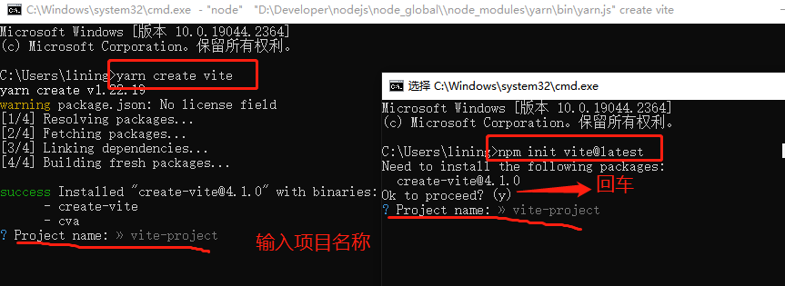
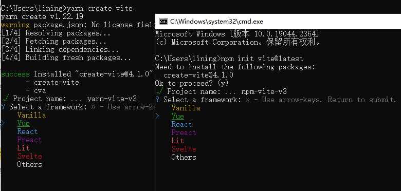
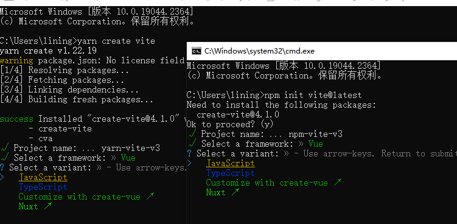
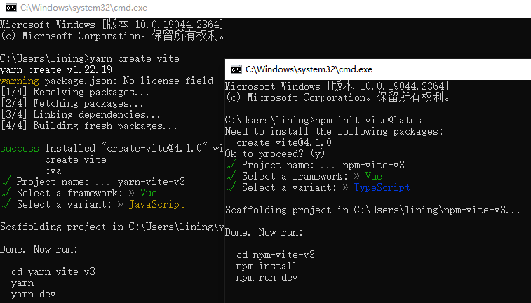
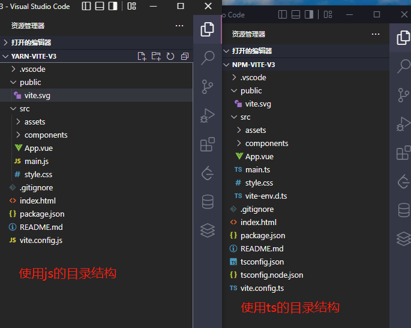
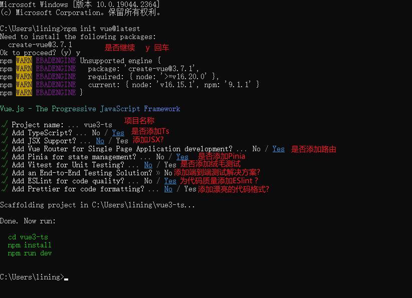

# 创建Vue3项目

## 一、 使用vue-cli创建
```bash
## 安装或者升级
npm install -g @vue/cli
## 保证 vue cli 版本在 4.5.0 以上
vue --version
## 创建项目
vue create my-project
```
然后的步骤

- Please pick a preset - 选择 Manually select features
- Check the features needed for your project - 选择上 TypeScript ，特别注意点空格是选择，点回车是下一步
- Choose a version of Vue.js that you want to start the project with - 选择 3.x (Preview)
- Use class-style component syntax - 直接回车
- Use Babel alongside TypeScript - 直接回车
- Pick a linter / formatter config - 直接回车
- Use history mode for router? - 直接回车
- Pick a linter / formatter config - 直接回车
- Pick additional lint features - 直接回车
- Where do you prefer placing config for Babel, ESLint, etc.? - 直接回车
- Save this as a preset for future projects? - 直接回车

## 二、 使用vite创建(推荐)
vite的优势
- 冷服务   默认的构建目标浏览器是能 在 script 标签上支持原生 ESM 和 原生 ESM 动态导入
- HMR  速度快到惊人的 模块热更新（HMR）
- Rollup打包  它使用 Rollup 打包你的代码，并且它是预配置的 并且支持大部分rollup插件

### 1. 使用vite初始化一个项目
```bash
# npm
npm init vite@latest

# yarn
yarn create vite
```

这两种使用vite创建vue3项目的步骤一样

(1).运行命令 输入项目名称


(2). 构建的项目模板


(3).选择语言


(4).切换目录，安装包，运行项目


(5).项目的目录结构



### 2. npm init vue@latest

