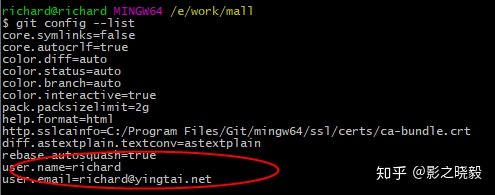
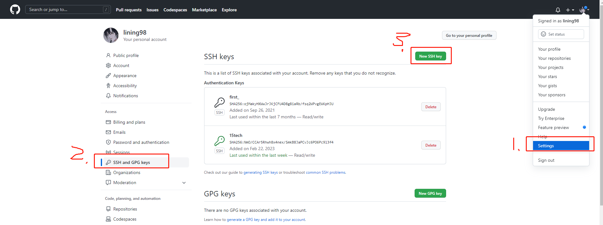
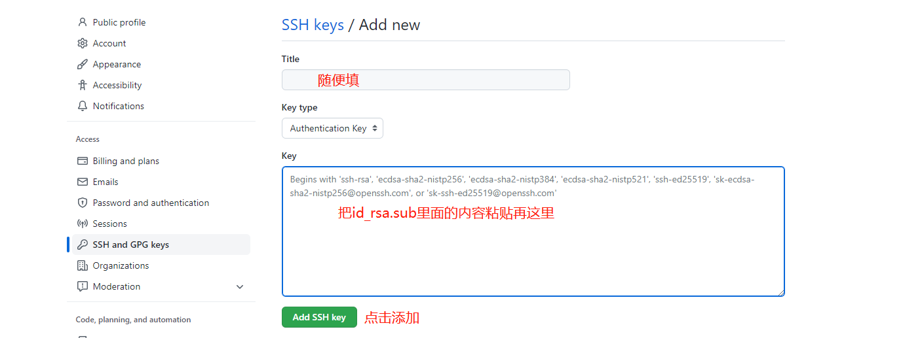

# git安装

## **1.Git官网下载安装git客户端：[https://git-scm.com/downloads/](https://git-scm.com/downloads/)**


## **2.安装完成后，在空白处点鼠标右键选择“Git Bush Here” ，打开git bash命令窗口**


## **3.配置用户名和邮箱**

git config —global user.name “xxx”

git config —global user.email “**[xxxx@xxx.com](mailto:richard@yingtai.net)**”

配置后结果：git config --list




## **4.执行命令生成ssh pub_key**

```
ssh-keygen -t rsa -C "XXXX@XXX.com"
```

直接按三次回车，会生成 id_rsa.pub 文件，这个文件一般在C盘的.ssh目录下。


## **5.打开生成后的id_rsa.pub文件，copy内容到git ssh个人设置**







## **6.本地拉取代码**

就可以克隆ssh地址了

## TortoiseGit安装
[TortoiseGit安装和配置详细说明](https://blog.csdn.net/weixin_44299027/article/details/121178817)


