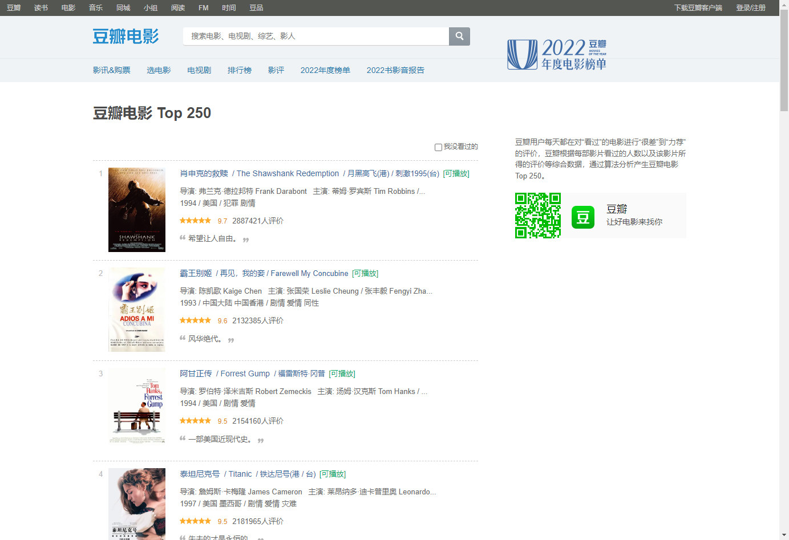
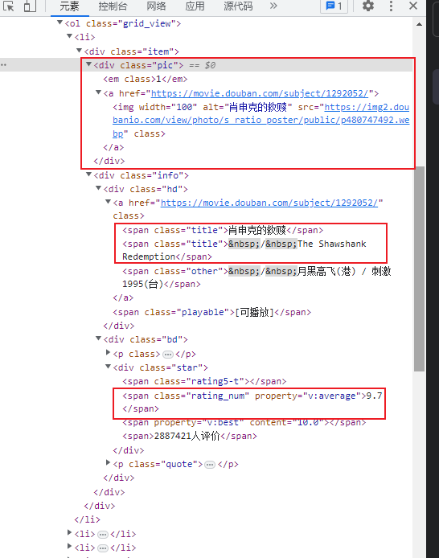

# 使用 node 做一个简单的爬虫

## 1. 初始化项目

```shell
npm init -y
```

## 2. 安装插件 cheerio

```shell
npm install cheerio
```

Cheerio 解析标记并提供用于遍历/操作结果数据结构的 API。它不会像网络浏览器那样解释结果。具体来说，它不会生成视觉渲染、应用 CSS、加载外部资源或执行 SPA（单页应用程序）常见的 JavaScript。

## 3. 访问要爬取的网站

- 爬取豆瓣网 `https://movie.douban.com/top250`
  
- 根据浏览器检查元素区，要爬取的内容
  

## 4。 创建 index.js 文件并编写代码

```js
// 引入模块
const https = require('https')
const cheerio = require('cheerio')
const fs = require('fs')

https.get('https://movie.douban.com/top250', function (res) {
  let html = ''
  res.on('data', function (chunk) {
    // console.log(chunk+'');
    // 得到数据流，通过字符串得到html结构
    html += chunk
  })

  res.on('end', function () {
    //   创建一个空数组，把数据以对象的形式存放在数组中
    let allFiles = []

    // 获取html中的数据
    const $ = cheerio.load(html)
    $('li .item').each(function () {
      const title = $('.title', this).text()
      const star = $('.info .bd .rating_num', this).text()
      const pic = $('.pic img', this).attr('src')

      allFiles.push({
        title: title,
        star: star,
        pic: pic
      })
    })
    //  console.log(allFiles);

    // 将数据写入文件中
    fs.writeFile('./files.json', JSON.stringify(allFiles), function (err, data) {
      if (err) {
        throw arr
      }
      console.log('文件保存成功')
    })
  })
})
```

## 5. 运行脚本

```shell
node index.js
```

## 6. 爬取成功


这时会多出来一个名叫`files.json`的 json 文件

里面就是爬取出来的内容了
```json
[
  {
    "title": "肖申克的救赎 / The Shawshank Redemption",
    "star": "9.7",
    "pic": "https://img2.doubanio.com/view/photo/s_ratio_poster/public/p480747492.jpg"
  },
  {
    "title": "霸王别姬",
    "star": "9.6",
    "pic": "https://img1.doubanio.com/view/photo/s_ratio_poster/public/p2561716440.jpg"
  },
  {
    "title": "阿甘正传 / Forrest Gump",
    "star": "9.5",
    "pic": "https://img2.doubanio.com/view/photo/s_ratio_poster/public/p2372307693.jpg"
  },
  {
    "title": "泰坦尼克号 / Titanic",
    "star": "9.5",
    "pic": "https://img9.doubanio.com/view/photo/s_ratio_poster/public/p2889314814.jpg"
  },
  {
    "title": "这个杀手不太冷 / Léon",
    "star": "9.4",
    "pic": "https://img2.doubanio.com/view/photo/s_ratio_poster/public/p511118051.jpg"
  },
  {
    "title": "千与千寻 / 千と千尋の神隠し",
    "star": "9.4",
    "pic": "https://img1.doubanio.com/view/photo/s_ratio_poster/public/p2557573348.jpg"
  },
  {
    "title": "美丽人生 / La vita è bella",
    "star": "9.6",
    "pic": "https://img2.doubanio.com/view/photo/s_ratio_poster/public/p2578474613.jpg"
  },
  {
    "title": "辛德勒的名单 / Schindler's List",
    "star": "9.6",
    "pic": "https://img2.doubanio.com/view/photo/s_ratio_poster/public/p492406163.jpg"
  },
  {
    "title": "星际穿越 / Interstellar",
    "star": "9.4",
    "pic": "https://img1.doubanio.com/view/photo/s_ratio_poster/public/p2614988097.jpg"
  },
  {
    "title": "盗梦空间 / Inception",
    "star": "9.4",
    "pic": "https://img9.doubanio.com/view/photo/s_ratio_poster/public/p513344864.jpg"
  },
  {
    "title": "楚门的世界 / The Truman Show",
    "star": "9.4",
    "pic": "https://img2.doubanio.com/view/photo/s_ratio_poster/public/p479682972.jpg"
  },
  {
    "title": "忠犬八公的故事 / Hachi: A Dog's Tale",
    "star": "9.4",
    "pic": "https://img1.doubanio.com/view/photo/s_ratio_poster/public/p2587099240.jpg"
  },
  {
    "title": "海上钢琴师 / La leggenda del pianista sull'oceano",
    "star": "9.3",
    "pic": "https://img9.doubanio.com/view/photo/s_ratio_poster/public/p2574551676.jpg"
  },
  {
    "title": "三傻大闹宝莱坞 / 3 Idiots",
    "star": "9.2",
    "pic": "https://img2.doubanio.com/view/photo/s_ratio_poster/public/p579729551.jpg"
  },
  {
    "title": "放牛班的春天 / Les choristes",
    "star": "9.3",
    "pic": "https://img1.doubanio.com/view/photo/s_ratio_poster/public/p2884280708.jpg"
  },
  {
    "title": "机器人总动员 / WALL·E",
    "star": "9.3",
    "pic": "https://img2.doubanio.com/view/photo/s_ratio_poster/public/p1461851991.jpg"
  },
  {
    "title": "无间道 / 無間道",
    "star": "9.3",
    "pic": "https://img2.doubanio.com/view/photo/s_ratio_poster/public/p2564556863.jpg"
  },
  {
    "title": "疯狂动物城 / Zootopia",
    "star": "9.2",
    "pic": "https://img1.doubanio.com/view/photo/s_ratio_poster/public/p2614500649.jpg"
  },
  {
    "title": "控方证人 / Witness for the Prosecution",
    "star": "9.6",
    "pic": "https://img1.doubanio.com/view/photo/s_ratio_poster/public/p1505392928.jpg"
  },
  {
    "title": "大话西游之大圣娶亲 / 西遊記大結局之仙履奇緣",
    "star": "9.2",
    "pic": "https://img9.doubanio.com/view/photo/s_ratio_poster/public/p2455050536.jpg"
  },
  {
    "title": "熔炉 / 도가니",
    "star": "9.4",
    "pic": "https://img9.doubanio.com/view/photo/s_ratio_poster/public/p1363250216.jpg"
  },
  {
    "title": "教父 / The Godfather",
    "star": "9.3",
    "pic": "https://img9.doubanio.com/view/photo/s_ratio_poster/public/p616779645.jpg"
  },
  {
    "title": "触不可及 / Intouchables",
    "star": "9.3",
    "pic": "https://img9.doubanio.com/view/photo/s_ratio_poster/public/p1454261925.jpg"
  },
  {
    "title": "当幸福来敲门 / The Pursuit of Happyness",
    "star": "9.2",
    "pic": "https://img9.doubanio.com/view/photo/s_ratio_poster/public/p2614359276.jpg"
  },
  {
    "title": "龙猫 / となりのトトロ",
    "star": "9.2",
    "pic": "https://img9.doubanio.com/view/photo/s_ratio_poster/public/p2540924496.jpg"
  }
]
```
