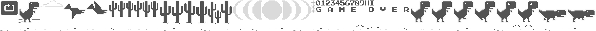

# 谷歌恐龙小游戏

## 素材图片


## 代码

```vue
<template>
  <div>app</div>
</template>

<script setup lang="ts">
// 导入pixi
import * as PIXI from 'pixi.js'
import { Sprite } from 'pixi.js'

// 创建应用
const app = new PIXI.Application({
  width: window.innerWidth,
  height: window.innerHeight,
  backgroundColor: 0xffffff,
  resolution: window.devicePixelRatio || 1 // 像素比
})

// 将应用画布添加到DOM中
document.body.appendChild(app.view as any)

// 创建容器
const container = new PIXI.Container()
// 将容器添加到舞台
app.stage.addChild(container)

// 添加恐龙游戏的纹理
const baseTexture = PIXI.BaseTexture.from('./textures/game.png')

// 创建恐龙纹理
const dinoTexture = new PIXI.Texture(baseTexture, new PIXI.Rectangle(75, 0, 88, 100))

// 创建恐龙精灵
const dino = PIXI.Sprite.from(dinoTexture)
dino.x = 60
dino.y = window.innerHeight - 50 - 100
dino.visible = true
// 将精灵添加到容器中
container.addChild(dino)

// 恐龙跑步动画
const runTextures = []
for (let i = 0; i < 2; i++) {
  runTextures.push(
    new PIXI.Texture(baseTexture, new PIXI.Rectangle(1680 + (2 + i) * 88, 0, 82, 100))
  )
}
const runAnimation = new PIXI.AnimatedSprite(runTextures)
runAnimation.animationSpeed = 0.1
runAnimation.play()
runAnimation.visible = false
container.addChild(runAnimation)

// 恐龙跳跃精灵
const jumpTexture = new PIXI.Texture(baseTexture, new PIXI.Rectangle(1680, 0, 82, 100))
const jumpSprite = new PIXI.Sprite(jumpTexture)
jumpSprite.x = 60
jumpSprite.y = window.innerHeight - 50 - 100
jumpSprite.visible = false
container.addChild(jumpSprite)

// 创建地面精灵
const groundTexture = new PIXI.Texture(baseTexture, new PIXI.Rectangle(50, 100, 2300, 30))
const groundSprite = new PIXI.TilingSprite(groundTexture)
groundSprite.width = window.innerWidth
groundSprite.height = 30
// 设置地面精灵的位置
groundSprite.position.set(0, window.innerHeight - 50)
container.addChild(groundSprite)

// 创建仙人掌精灵
const cactusTexture = new PIXI.Texture(baseTexture, new PIXI.Rectangle(515, 0, 30, 60))
const cactusSprite = new Sprite(cactusTexture)
cactusSprite.x = window.innerWidth / 2
cactusSprite.y = window.innerHeight - 50 - 60
container.addChild(cactusSprite)

// 创建文字
let startText = new PIXI.Text('开始游戏', {
  fontFamily: 'Arial',
  fontSize: 36,
  fill: 0x333333,
  align: 'center'
})
startText.x = window.innerWidth / 2
startText.y = window.innerHeight / 2
startText.anchor.set(0.5)
container.addChild(startText)

startText.interactive = true
startText.on('click', () => {
  playGame()
})

let isGaming = false
let isGameover = false
// 开始游戏
function playGame() {
  isGaming = true
  startText.visible = false
  dino.visible = false
  console.log('开始游戏')
  // 显示恐龙的跑步动画
  runAnimation.visible = true
  runAnimation.x = 60
  runAnimation.y = window.innerHeight - 50 - 100
}

// 游戏得分
let score = 0
// 初始化跳跃的速度
let jumpVelocity = 20
// 初始化重力
let gravity = 1

// 游戏循环
app.ticker.add(() => {
  if (isGameover) return
  if (isGaming) {
    // 地面移动
    groundSprite.tilePosition.x -= 10
    // 仙人掌移动
    cactusSprite.x -= 10
    if (cactusSprite.x < 30) {
      cactusSprite.x = window.innerWidth
      score++
    }
  }
  if (jumpSprite.visible) {
    jumpVelocity -= gravity
    jumpSprite.y -= jumpVelocity
    if (jumpSprite.y > window.innerHeight - 50 - 100) {
      jumpSprite.y = window.innerHeight - 50 - 100
      jumpVelocity = 20
      jumpSprite.visible = false
      runAnimation.visible = true
    }
  }
  // 检测碰撞
  if (
    jumpSprite.y > cactusSprite.y - 60 &&
    cactusSprite.x < jumpSprite.x + 60 &&
    cactusSprite.x > jumpSprite.x - 60
  ) {
    // 游戏结束
    gameOver()
    startText.visible = false

    // 显示游戏结束的文字
    let overText = new PIXI.Text('游戏结束，最后得分：' + score, {
      fontFamily: 'Arial',
      fontSize: 36,
      fill: 0x333333,
      align: 'center'
    })
    overText.x = window.innerWidth / 2
    overText.y = window.innerHeight / 2
    overText.anchor.set(0.5)
    container.addChild(overText)

    overText.interactive = true
    overText.on('click', () => {
      location.reload()
    })
  }
})
function gameOver() {
  console.log('游戏结束')
  isGameover = true
}

window.addEventListener('keydown', (e) => {
  if (e.code == 'Space') {
    console.log('跳跃')
    runAnimation.visible = false
    jumpSprite.visible = true
    jumpVelocity = 20
  }
})
</script>
```
