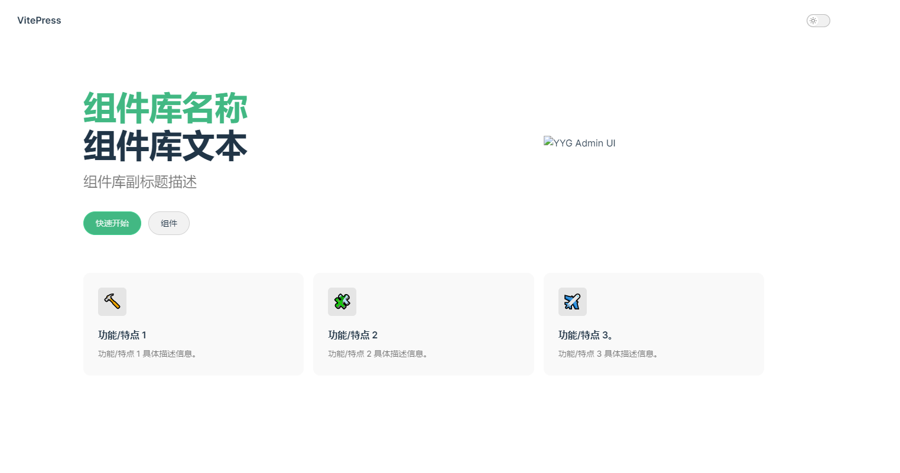
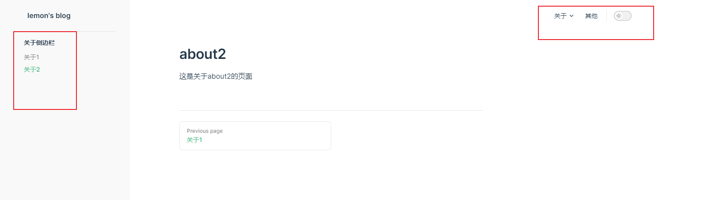

# VitePress 从 0 开始搭建个人网站

> lemon's blog 从无到有的过程
>
> [VitePress 官方网站](https://vitepress.vuejs.org/)
>
> [VitePress 中文网](https://vitejs.cn/vitepress/)

## 一、 创建项目

- 在 gitbub 上新建项目，建议勾选 Add a README file

- 新建文件夹 blog
  可以使用 npm，yarn，pnpm

### 初始化项目

```bash
npm init -y
```

- 安装 vitepress

```bash
yarn add --dev vitepress vue
```

- package.json 添加 script

```json
"scripts": {
    "docs:dev": "vitepress dev docs",
    "docs:build": "vitepress build docs",
  }
```

- 新建文件夹`docs`
- 在文件夹`docs`内新建`index.md`文件

**使用 git bash**

- 如果下载了 git，可以在当前的文件夹右键，选择 Git Bash Here
- 也可以在 vscode 上使用，按 Ctrl+J 打开终端，点击'+'符号右边的下三角，选择 Git Bash
- 输入以下命令

```bash
$ mkdir docs && echo '# Hello VitePress' > docs/index.md
```

### npx 创建项目

```shell
npx create-vitepress my-site
```

```shell
cd my-site
npm install  或 yarn install
npm run dev  或 yarn dev
```

### 本地运行

- 运行

```shell
yarn docs:dev
```

- 打包

```shell
yarn docs:build
```


## 二、 基本配置

### 目录结构

在目录下新建 docs 文件夹，在其中新建.vitepress 文件夹和 config.js 文件，config.js 文件就是我们的配置文件，新建一个 index.html 作为我们的主页，在新建一个 public 文件夹用于静态资源的引用，目录结构如下：

```
├─ docs
│  ├─ .vitepress
│  │  └─ config.js
|  ├─ about
│  │  ├─ about1.md
│  │  └─ about2.md
│  ├─ public
│  └─ index.md
└─ package.json
```

### 1. 配置首页

vitepress 支持用户使用 yaml 配置页面的内容，在 docs/index.html 写下如下内容，更多配置请查看

```md
---
layout: home

title: 选项卡标题
titleTemplate: 选项卡描述
editLink: true
lastUpdated: true
hero:
  name: 组件库名称
  text: 组件库文本
  tagline: 组件库副标题描述
  image:
    src: /logo.png
    alt: YYG Admin UI
  actions:
    - theme: brand
      text: 快速开始
      link: /guide/
    - theme: alt
      text: 组件
      link: /components/
features:
  - icon: 🔨
    title: 功能/特点 1
    details: 功能/特点 1 具体描述信息。
  - icon: 🧩
    title: 功能/特点 2
    details: 功能/特点 2 具体描述信息。
  - icon: ✈️
    title: 功能/特点 3。
    details: 功能/特点 3 具体描述信息。
---
```


### 2. 配置网站

#### 配置导航栏部分

在 config.js 中可以开始我们的配置，先写上如下内容，这是网站的标题和描述，标题会在浏览器标签上展示

```js
export default defineConfig({
  base: '/docs/', // 和github项目名称保持一致
  title: '标题',
  description: '描述',
  themeConfig: {
    siteTitle: '标题', //左上角的
    logo: '/img/logo.png', //左上角的logo,注意：它的路径是从public文件夹开始的，所以这里引用的是public/logo.jpg这张图
    nav: [
      //右上角的导航栏
      {
        text: '关于', //导航标签的名字
        items: [
          //这种格式是有下拉菜单的版本
          { text: '关于1', link: '/about/about1' },
          { text: '关于2', link: '/about/about2' } //text代表每一项的名字，link是连接的位置
        ]
      },
      { text: '其他', link: '' } //这种是没有下拉菜单的版本
    ]
  }
})
```

Vitepress 的根目录是从 docs 开始算的，比如你在 docs 下创建一个 notes 文件夹，那么它的路径就是/notes。

#### 配置侧边栏部分

```js
themeConfig: {
  // ...省略前面的内容
  // 侧边栏
  sidebar: {
    "/articles/other": [
      {
        text: "关于侧边栏",
        collapsible: false, //是不是可以动态展开
        collapsed: false, //默认是不是展开
        items: [
          { text: "关于1", link: "/about/about1" },
          { text: "关于2", link: "/about/about2" },
        ],
      },
    ],
  },
  // ...
}

```


## 三、 部署到 github.io

新建脚本文件 deploy.sh，与 docs 文件夹处于同一级

```bash
#!/usr/bin/env sh

# 确保脚本抛出遇到的错误
set -e

# 生成静态文件
yarn docs:build

# 进入生成的文件夹
cd dist

# 如果是发布到自定义域名
# echo 'www.example.com' > CNAME

git init
git add -A
git commit -m 'deploy'


# 发布到 https://<USERNAME>.github.io/<REPO>
git push -f git@github.com:lining98/docs.git master:gh-pages

cd -
```

配置 package.json

```json
  "scripts": {
    // ...
    "deploy": "bash deploy.sh"
  },

```

使用 git bash 运行

```bash
./deploy.sh
or
yarn deploy
```

打开 github 项目，点击分支，可以看到会多个一个名 gh-pages 的分支，这个分支存放着就是打包好的代码。

settings -> Pages

会有一个地址，这个地址就是部署之后的地址了。

这个项目是实时更新的不需要你重新部署操作，你要做的就是更新你的 master 分支即可
